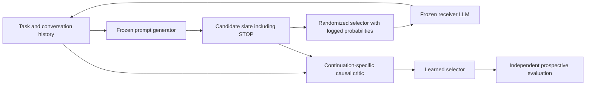

# DTR-MultiRoundLLM

> **Hourly continuation:** [family/specification audit](docs/landmark_family_audit_20260920.md), [inference review](docs/landmark_inference_review_20260920.md), [grading validation](docs/landmark_grading_validation_20260920.md), [manuscript methods](manuscript/landmark_methods_20260920.md), and [monitoring checkpoint](docs/monitoring_checkpoint.md). Real collection remains subject to receiver, measurement and fresh-root gates.

> **Current scientific judgment:** [our design, negative findings and decision](docs/scientific_judgment_20260920.md). The coordinating agent owns the design and interpretation. The tested repair process improves initial answers but loses to resampling; absent informative checks are a major stopping defect; the previously highlighted 7B selector gain is split-sensitive. Pause generator/architecture expansion until a fresh, same-target prompt-choice study clears a prespecified usefulness gate. This is not a submission-ready empirical claim.

**Causal value models and generative prompting policies for multi-round LLM interaction.**

Given a task and a frozen receiver LLM, estimate how a proposed next prompt changes the expected final outcome, conditional on the conversation and a specified continuation policy. Use those values to choose feedback or STOP, then study a learned prompt generator as an autonomous adaptive user.

This repository contains a developed theory and experiment package, a tested finite-state statistical reference, and a bounded local collector. **Neural critic training and real-LLM superiority experiments remain pending.** The inferential target is a history-conditional mean contrast, not the realized individual effect for one conversation.

Read [COORDINATION.md](COORDINATION.md) for the active experiment workstream and the theory responses to Q1–Q10. Existing task-pool audits and sandbox tooling are preserved; their execution is attributed separately.

The [earlier September 20 research PDF](manuscript/DTR_MultiRoundLLM_Audited_Theory_and_Experiments_2026-09-20.pdf) contains the original theory, the stopping addendum and corrected results. It predates the later scientific self-audit and landmark supplement; the current editable documents govern. The historical [28-page research PDF](manuscript/DTR_MultiRoundLLM_Theory_and_Experiments_2026-09-19.pdf) combines the theory, training specification, protocol, synthetic results, and handoff. Editable sources are below.

## Latest continuation — 20 September 2026

Read the [scientific judgment](docs/scientific_judgment_20260920.md) and [hourly checkpoint](docs/monitoring_checkpoint.md) first. The [landmark design](docs/landmark_prompt_theory.md), seven exact check groups, 1,200-dataset known-truth personalization study and bounded collector remain available. The latest continuation adds source-family curation, a private grading adapter and finite-sample inference safeguards. A specific 24-root law exposes 91.28% coverage for the earlier nominal 95% normal interval; conservative bounds now state their fixed-weight independent-family assumptions and multiplicity scope. A zero average arm contrast still does not rule out personalized benefit; a best-observed-branch gain does not establish deployable benefit.

The [task-source audit](docs/landmark_task_source_candidates_20260920.md) identifies 544 candidate MBPP IDs after known prior-description exclusions, including 242 official-test IDs. A fixed 24-task manual review retained seven for further contract review, excluded seven probable old-family variants, and held ten for specification defects, without replacements. None is a validated fresh evaluation task. Host isolation startup checks failed, so benchmark execution remains blocked. No new receiver calls or benchmark-code executions occurred. The [prior continuation report](docs/continuation_report_20260920.md) and immutable diagnostics remain available; the previously highlighted 7B +2.85-point split is exploratory and split-sensitive.

**Still required:** audited task families and evaluator, pinned live receiver, frozen collection contract, actual prompt-intervention data and independent policy validation. The full project is not submission-ready. Larger generator development remains conditional on the prompt-choice premise.

Validation at this checkpoint: **121 tests and two subtests pass**. These include mocked grading and exact inference checks; the 31 failed controlled startup attempts do not validate runtime containment or benchmark outcomes.

## Start here

| Document | Purpose |
|---|---|
| [Research proposal](docs/research_proposal.md) | Scientific question, contribution, application, and evidence needed |
| [Full theory and proofs](docs/theory.md) | Identification; support; language representations; DR/EIF; conditional labels; improvement; candidate coverage; inference |
| [Proof audit](docs/theory_proof_audit.md) | Conditions, proof checks, and unresolved extensions |
| [Training and serving](docs/training_and_serving.md) | Concrete critic, generator, and autonomous-user implementation contract |
| [Experiment protocol](docs/experiment_protocol.md) | Simulations, randomized feedback, branch calibration, and locked policy trials |
| [Data contract](docs/data_contract.md) | Slates, propensities, exact prompts, costs, branch lineage, and hidden-label separation |
| [Literature audit](docs/literature_audit.md) | Verified primary sources, closest precedents, and corrected novelty claims |
| [Experimental-agent handoff](docs/experiment_handoff.md) | Work packages, ownership, acceptance criteria, and reply format |
| [Project status](docs/project_status.md) | Executed checks, actual evidence, outstanding work, and GitHub coordination |

## Key design



Free-form candidates are allowed. Randomized selection identifies supported comparisons within the declared generator distribution. A changed generator requires its valid full density ratio or newly collected randomized data. A semantic embedding does not create support or identify arbitrary unseen text. Correctly history-adjusted sequential regression is a required strong baseline; causality is established by the design and assumptions, not by the critic's name.

## Run the reference checks

Python 3.12+ and `uv` are recommended. No paid model calls are used by these commands.

```bash
uv run --extra dev pytest -q
```

See `scripts/` and `results/` for the exact synthetic simulation command, configuration, seeds, and machine-readable results. These numerical checks concern a finite data-generating process with known truth; they do not establish a trained language model's performance.

The collector can be checked without contacting any model:

```bash
uv run python experiments/collect_ollama.py \
  --config experiments/collector_config.json \
  --tasks experiments/smoke_tasks.jsonl \
  --output work/collector_smoke_new \
  --dry-run
```

Before actual model calls, commit the experiment protocol, configuration, candidate definitions, randomization and analysis plan, and record the freeze revision as required by AGENTS.md. For an actual local smoke test, create a configuration with an exact installed Ollama model tag, retain a bounded call/time budget, and omit `--dry-run`. The collector refuses nonlocal services and existing output directories. It records model metadata, full requests/responses, assignment probabilities, failures, token counts, and checksums. Arithmetic fixtures are transport and parser checks; use the experimental protocol for substantive benchmark selection. The current collector uses fixed template candidates and does not implement a trained critic or generated-slate collection.

## Research status and collaboration

The core DTR and DR results are established foundations specialized here with explicit proofs. Candidate-generation scope, history-conditional learning, and independent evaluation form the proposed research direction; novelty and practical superiority are not asserted merely from the formulation. The package separates proof, synthetic numerical validation, model feasibility, and prospective empirical evidence.

Experimental work is coordinated through the linked [issues](https://github.com/ykzeng-yale/DTR-MultiRoundLLM/issues). An agent should claim its issue, pin a branch and budget, and return a PR with reproducible artifacts. Follow [AGENTS.md](AGENTS.md). An issue's existence does not mean another agent has begun work.
