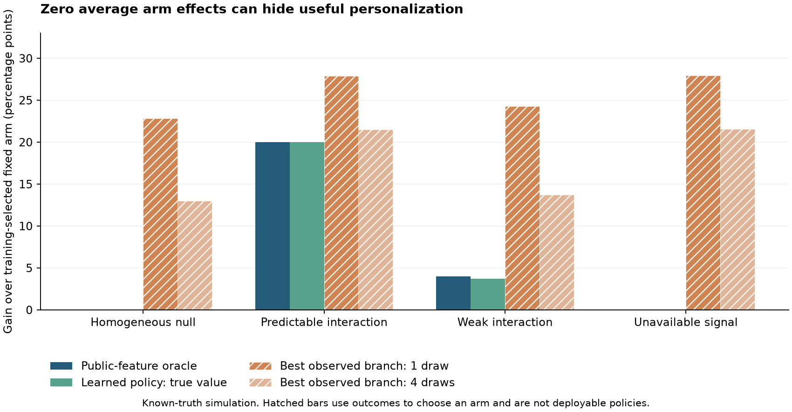

# Personalized-policy premise simulation: results and scientific judgment

20 September 2026. **Synthetic known-truth diagnostic, not evidence of real prompt efficacy.** The [plan](landmark_premise_simulation_plan.md) was committed before execution at `4f957af`; all four scenarios and both repetition analyses are retained. There are 1,200 independent train/test simulated datasets, each with 800 training and 800 evaluation roots, and 2,400 evaluations because r=1/r=4 reuse nested draws from each dataset. Monte Carlo summaries do not pool those nested analyses as independent evidence.

## What the study tests

Every scenario has exactly zero marginal arm contrast by construction. The learner estimates the two action means within a binary public history from uniformly randomized training assignments. A fixed comparator also chooses its arm only from training. Both policies are frozen before independently generated evaluation roots; all roots contribute to the paired contrast. There is no neural model, text representation or DR-specific learner here. This isolates whether the design can distinguish predictable choice from post-outcome optimism. It is a diagnostic of an established policy-learning distinction, not a novel algorithm; see [Athey and Wager](https://arxiv.org/abs/1702.02896).

| Scenario | Repetitions/arm | True learned-policy gain, pp | Estimated gain, pp | Sample-max excess over public-history oracle, pp | Coverage (MCSE) | Lower endpoint >0 |
|---|---:|---:|---:|---:|---:|---:|
| homogeneous_null | 1 | 0.00 | -0.02 | 22.82 | 0.990 (0.006) | 0.007 |
| homogeneous_null | 4 | 0.00 | 0.03 | 12.98 | 0.983 (0.007) | 0.007 |
| qualitative_interaction | 1 | 20.00 | 20.04 | 7.91 | 0.963 (0.011) | 1.000 |
| qualitative_interaction | 4 | 20.00 | 19.97 | 1.51 | 0.940 (0.014) | 1.000 |
| weak_interaction | 1 | 3.71 | 3.71 | 20.27 | 0.960 (0.011) | 0.573 |
| weak_interaction | 4 | 3.71 | 3.75 | 9.74 | 0.963 (0.011) | 0.927 |
| unavailable_signal | 1 | 0.00 | -0.05 | 27.96 | 0.970 (0.010) | 0.010 |
| unavailable_signal | 4 | 0.00 | -0.01 | 21.54 | 0.977 (0.009) | 0.007 |

Gains are relative to the training-selected fixed comparator. Coverage is for the learned policy's population contrast conditional on its training data, using an approximate 95% paired-root Wald interval. The full outputs include Monte Carlo SE for every summary, all replication records, software versions, hashes and timing in `results/landmark_premise_20260920/`.

The figure uses known population values of the fitted rules; its hatched bars select with evaluation outcomes. It is derived from the saved summaries and reproduced by `scripts/plot_landmark_premise.py`.

## Interpretation and correction to our design

1. **Do not kill personalization because average effects cancel.** The qualitative-interaction cell has a 20-point attainable gain by construction, although neither fixed arm has higher marginal value. The learner recovers it. An average-effect-only premise gate would wrongly terminate this case. The weak-interaction cell has 4-point oracle headroom; finite training produces a 3.71-point mean gain, so attainable headroom and learned performance also differ.
2. **A sampled oracle can look impressive when no public-history choice helps.** Under the homogeneous null, selecting the best observed branch exaggerates the public-history oracle by 22.82 points with one draw and 12.98 points with four. Those quantities are post-outcome selections, not achievable gains. Independent frozen-policy evaluation stays near zero.
3. **More repeats do not create unavailable decision information.** In the unavailable-signal cell, an unobserved variable fixed within each root controls which arm is better. The policy observes only the independent public variable. Its true gain is zero. The sample-max excess combines outcome noise with a 20-point information gap that remains even with infinitely many repetitions. Branches are independent conditional on the full root state, not conditional on the coarsened public feature alone; a 1/sqrt(r) bound cannot be applied to the entire excess.
4. **Repeats can help measurement, subject to cost.** In the weak cell, the positive-interval rate rises from .573 to .927 at the same 800 roots when four continuations replace one. That pays four times the continuation cost; it is not a fair-budget superiority result, and the between-root variation remains. A powered real study must allocate its fixed budget between roots and repetitions.

Null coverage above nominal partly reflects fitted rules identical to the fixed comparator, making every paired difference exactly zero. It does not establish uniform conservative coverage of Wald intervals. The unavailable-signal case also is not evidence of failed causal identification under randomized actions: it shows a restriction on deployable predictors/information. Neither a successful finite-law learner nor any theorem here establishes that natural-language histories contain useful effect-modification signals for the selected receiver.

## Validation and next experiment

Two invariant tests establish zero marginal contrasts with nonzero personalization headroom, and zero public-history headroom despite hidden root-specific effects. An independent internal reviewer checked the simulator, fitted-rule truth, train/test independence, nested draws, root-level variance, source hash and all summaries; no blocking mismatch was found. Runtime was about 0.47 seconds on local CPU, with no LLM calls, candidate-code execution, GPU work or external spending.

The real-study criterion is now the frozen policy's useful held-out value improvement, supported by public-history conditional evidence, rather than a required nonzero average prompt contrast or a large best-observed-branch gap. The [landmark protocol](landmark_experiment_protocol.md) specifies the contrasts and release gates. Full-project readiness remains below submission: fresh tasks, receiver/evaluator validation, actual prompt randomization/branch execution, independent policy evaluation and manuscript integration remain required.

Source provenance note: the plan was committed before execution; the script was an uncommitted working-tree file when run and is identified exactly by the manifest's SHA-256. It is published with the resulting records. The manifest's code_revision names the plan commit and must not be read as a claim that this commit already contained the diagnostic script. All recorded result files remain unchanged.
