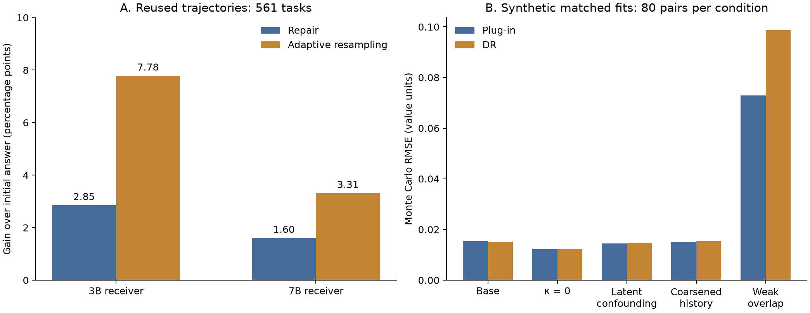

# Evaluating history-dependent prompt choice in multi-round language-model interaction

Working title and manuscript entry point, created 22 September 2026; current synthesis updated 27 September 2026. This is an editable synthesis of the current evidence, not a submission-ready paper. It supersedes the empirical framing of the dated PDFs without replacing their historical records. Updated 25 September: E12 outcome delivery `1f65447` is independently reconciled, with its negative result and measurement limitations retained. E13a adds a finite five-checkpoint restart-package follow-up with saved outcomes and the completed additive archive independently checked. The studies remain separate. The 27 September integration adds completed finite measurement audits, the current prospective learner/coupling/inference choices, and the reviewed-source population limitation. It adds no receiver outcomes or independent policy validation.

## Abstract

Choosing a follow-up prompt is a sequential decision: the preceding answer affects both the next instruction and the outcome it may produce. We formulate prompt choice for a fixed receiver as a dynamic treatment regime, targeting supported history- and slate-conditional mean outcomes rather than a realized individual effect. The framework distinguishes candidate generation from selection, local continuation comparisons from whole-policy evaluation, and identification from decision quality. Standard longitudinal identification and estimation results motivate a design that preserves an initial conversation prefix, executes prespecified prompt alternatives, isolates private scoring, and accounts for failures and computation.

Evidence remains developmental. In a reused corpus of 4,488 episodes from 561 coding tasks, the evaluated repair regime trailed adaptive resampling by 4.93 and 1.71 percentage points for the 3B and 7B receivers, respectively; this was not a prospective comparison at exactly matched total cost. A separate 77-call study on seven previously inspected tasks compared diagnostic-directed and neutral continuation instructions given identical public diagnostic information. Six initial answers passed the private suite. The primary observed mean difference was zero on every task; the prespecified context-removal package, which retained the public diagnostic, had a mean task-pass rate one seventh lower than neutral continuation. Two missing grades in a secondary arm were retained and examined separately. A subsequent 154-call study on 14 prospectively fixed development tasks found a directed-minus-neutral mean difference of −3.57 percentage points; no fixed continuation improved on STOP. All grades were available, but private suites were thin and some failures arose from answer-format violations. A 60-call follow-up at five already inspected checkpoints found 9/30 private-suite passes for diagnostic-plus-instruction restart versus 12/30 for bare-task resampling; output-delivery failures, selected histories and thin private suites limit interpretation. These finite results establish neither equivalence nor absence of useful history-dependent effects. Separately, a nine-task measurement audit found that all nine original-example lookup controls passed the original private suites but failed prospectively specified supplemental checks. Those controls were used in measurement development; the result neither estimates model memorization nor validates grading on unseen errors. The studies support an auditable evaluation design and preserve negative findings, but do not establish improved personalized prompting. Independent evaluation of a frozen public-history policy remains necessary; no eligible population and sampling contract has yet been released.

## Scientific contribution and scope

The question is whether information available before the next message can support a prompt choice that improves the fixed receiver's expected final score. A favorable best-of-observed-branches summary would not answer that question: the deployed rule cannot choose using future private scores. Conversely, a null average contrast between two strategies does not exclude opposite conditional benefits. The paper therefore separates the definition of a supported effect, its estimation from an explicit collection design, the predictability of conditional rankings, and independently evaluated policy value.

The methodological contribution is the specification and audit of these distinctions for language-valued interventions. Classical dynamic treatment regime identification, importance weighting and augmentation are foundations, not claimed inventions. Candidate-first randomized selection identifies comparisons within its supported slate law; it does not automatically evaluate a changed prompt generator. Repeated continuations can inform checkpoint response means but do not by themselves identify the history distribution induced by a new multiround policy. These boundaries control both the theory claims and the empirical interpretation.

The empirical contribution currently consists of corrected reused-data diagnostics and fresh, finite development executions. The seven-root E11 result is retained as a negative finding for its frozen strategies and scoring contract. The independently reconciled 14-root E12 batch supplies another negative development result for its primary strategy contrast. Its adapted tasks, public information and thin private suites differ from E11, so it is a separate development study. Neither a passing instrument check nor a negative small-sample contrast substitutes for independent policy validation.

## Relation to established methods and prior prompting work

Dynamic treatment regimes formalize sequential decisions adapted to observed history (Murphy, 2003). Longitudinal doubly robust estimation and sequential off-policy evaluation have established foundations (Bang and Robins, 2005; Jiang and Li, 2016). Our use of these tools does not establish a new identification principle, universal efficiency, or a finite-sample advantage over fitted regression. The proposed paired-family interval likewise specializes classical bounded-mean concentration (Hoeffding, 1963). The design-specific question is whether supported user-side interventions yield predictable conditional rankings and useful independently evaluated policies under a fixed receiver and explicit information, measurement and cost contracts.

There are close predecessors in the language setting. CausalCollab studies longitudinal human–LM refinement and identifies an incremental stylistic effect under stated conditions (Zhang et al., 2024). Zhang et al. (2025) explicitly formulate natural-language action learning through dynamic treatment regimes and Q-learning. Kiyohara et al. (2025) study contextual prompt optimization from logged bandit feedback. Fresh and Shin (2026) distinguish assignment to a conversational policy from effects of realized messages. C3 studies counterfactual action continuation in replayable cooperative-agent settings (Chen et al., 2026). Accordingly, neither causal analysis of conversations, language-valued DTR learning, contextual prompt personalization nor restored-history branching is claimed as an original concept here. Our target specifies an automated user's next instruction to a fixed receiver, its supported slate, the future continuation and the population law; this specification is a scoped research contribution to assess, not an established priority claim. Preprint citations refer to the versions listed below, without inferring peer review or independently replicating their experiments.

Iterative prompting also has established implementations. Self-Refine uses model-generated feedback to revise an output (Madaan et al., 2023); Reflexion uses verbal feedback and episodic memory to guide later attempts (Shinn et al., 2023). These motivate comparisons with feedback and resampling, but a named algorithm is not a single intervention independent of its evidence access, stopping rule and budget. Our completed E11–E13a executions test their own frozen recipes; they are not reproductions or head-to-head evaluations of those methods. A future baseline adapted from them must declare its actual diagnostic access, final-artifact selection and full cost. The proposed PATCH/RETHINK learner also remains a restricted landmark test rather than a validated general prompting optimizer. The [version-specific literature audit](../docs/literature_recheck_20260920.md) and [design/code review](../docs/literature_guided_design_20260921.md) retain the detailed comparisons and unresolved novelty questions.

## Estimand, assumptions and identification

Let $Z=(H,C)$ contain the public pre-selection history and the complete ordered slate generated before assignment. Let $\mu$ be the joint landmark law of $(H,C)$ induced by the prefix law and frozen candidate generator. Fix the receiver and decoding law, evaluator, and future continuation policy $\nu$. For data-trained policies, interpret the following expectations conditional on the frozen development information and require the declared evaluation law to remain valid under that conditioning. For a supported index $a$, define

$$
Q_a^\nu(z)=E[Y^{a,\nu}\mid Z=z],\qquad
V_\mu^\nu(d)=E_\mu\sum_a d(a\mid Z)Q_a^\nu(Z).
$$

The distribution $\mu$ must follow the declared family/root weighting and prefix law; no particular population is adopted by these equations. Here $Y\in[0,1]$ is the declared quality endpoint and $d$ is a policy frozen before evaluation outcomes. Costs are separate outcomes until a utility conversion and range are fixed. The local contrast $Q_a^\nu(z)-Q_b^\nu(z)$ changes the next intervention while holding the named future policy fixed. It is not a realized individual effect and is not automatically the value of repeatedly deploying a new selector. An index denotes its complete rendering/context rule; changing a generator, evaluator or continuation changes the target.

The following distinctions govern the identification argument. “By construction” describes a requirement of a correctly implemented prospective design, not a verified property of an unreleased experiment.

| Condition | What design can fix | What remains assumed or must be audited |
|---|---|---|
| Treatment consistency | Exact recipe,slate order,receiver/decoder versions and continuation are frozen | Requests execute that law; no hidden renderer or environment changes |
| Assignment exchangeability | Draw the action using recorded probabilities and random input independent of latent checkpoint/outcome variables conditional on $Z$ | The implementation actually uses that randomization and logs the correct probabilities |
| Supported intervention | Give every queried action positive probability,or prespecify execution of every supported branch | Useful finite-sample overlap; support for a different string,generator or future history is not supplied |
| Branch stability and observation | Reset rules,scoring identity,failure semantics and all-assigned accounting are fixed | Restoration,no cross-branch interference,conditional deployment-law agreement and valid measurement |
| Population and inference | Declare family membership,weights,split and sampling/seed laws before outcomes | Those laws align with the claimed population and provide the required conditional independence; task labels alone do not |
| Policy information | Restrict serving inputs and freeze the policy before evaluation | No test-root branch labels or private scores influence policy choices; source-development exposure is disclosed separately |

Under consistency,valid conditional randomization,positive support and the declared observed-outcome law, a randomized landmark slot with probability $e(a\mid Z)$ and observed $Y$ following the assigned intervention and declared continuation $\nu$ identifies

$$
V_\mu^\nu(d)=E\left[\frac{d(A\mid Z)}{e(A\mid Z)}Y\right].
$$

This is standard inverse-probability identification, not a new result (Bang and Robins, 2005). Under complete intervention execution with prespecified positive branch counts and action-specific conditional means matching deployment, a frozen comparison instead uses

$$
D_i=\sum_a\{d(a\mid Z_i)-\beta(a\mid Z_i)\}\bar Y_{ia}.
$$

Its expectation identifies the policy difference under the declared landmark law and weights; complete branch inclusion needs no action-assignment weight. Independence among branches is unnecessary for this mean identity,but variance/inference needs its own family-level conditions. Related roots are aggregated with the frozen within-family weights before equal-family evaluation. The formulas assume observed scores; missing outcomes use the separately specified valid bounds and retain all assigned units. Choosing $d$ using these same evaluation branch outcomes invalidates the frozen-policy interpretation. [Landmark assumptions and proof,L1](../docs/landmark_prompt_theory.md#2-identification-by-branch-execution-with-its-actual-assumptions).

For a longitudinal target with the same frozen generator as logging, the conditional generator factor cancels from each action ratio,leaving the selector ratio $\pi_t(J_t\mid H_t,C_t)/b_t(J_t\mid H_t,C_t)$. This requires the same actual ordered-slate law after filtering and rendering,and supported target histories. A changed generator requires its own valid joint-slate density ratio or new execution; selected-index propensities do not supply it. Full-history sequential regression and doubly robust augmentation address the same identified target under their respective conditions. The DR identity does not establish smaller finite-sample error,better ranking or policy improvement. [Core identification and estimation](../docs/theory.md); [proof-audit boundaries](../docs/theory_proof_audit.md). These are applications of established longitudinal causal inference and off-policy evaluation,with sources collected in [the theory bibliography](../docs/theory.md#12-source-grounding).

For two supported recipes available at every record,write $\Delta(Z)=Q_1^\nu(Z)-Q_0^\nu(Z)$. The public-information oracle's gain over the best fixed recipe is

$$
\mathcal H=\frac{E|\Delta(Z)|-|E\Delta(Z)|}{2}.
$$

This elementary conditional-expectation identity concerns an oracle,not the fitted learner. Thus a zero marginal contrast does not rule out useful personalization,and a positive marginal contrast does not establish it. With a restricted feature map $X=\phi(Z)$,the relevant oracle uses $E[Q_a^\nu(Z)\mid X]$; it may discard useful history. Repeated seeds at one latent checkpoint estimate that checkpoint's response mean,not automatically the public-record conditional mean or a new-family population value. Fresh evaluation seeds also do not undo policy adaptation to branch labels from the same test root. [Personalization and oracle distinctions,L2–L3](../docs/landmark_prompt_theory.md#3-zero-average-arm-effects-do-not-exclude-useful-personalization).

Finally, applying a learned action rule repeatedly changes later history distributions. Transporting a landmark contrast requires both supported history-distribution change and invariance of the relevant conditional outcome law; a history density ratio alone cannot repair a changed latent checkpoint mixture or continuation. The proposed one-decision experiment therefore tests a restricted empirical part of the original multi-round program. It cannot certify the full adaptive generator/selector/STOP system. [Landmark transport scope](../docs/landmark_prompt_theory.md#7-landmark-distribution-is-not-global-policy-occupancy).

## Completed evidence: outcomes and their interpretation

The evidence layers below answer different questions and are not pooled. Historical corpus analyses reuse outcomes; the receiver studies are finite development executions; the estimator comparisons are synthetic. None is confirmatory evaluation of a learned next-prompt/STOP policy on untouched task families. Arithmetic and saved-record provenance have been independently reconciled within the scopes of the linked reviews; this is distinct from independently repeating the receiver executions.

### Reused trajectories and candidate selection

In the historical corpus of 4,488 episodes from 561 coding roots, the corrected paired-change analysis uses the known routing probabilities across all 561 roots to evaluate the policy that retains the initial receiver on subsequent eligible repair calls, and compares it with an adaptive three-draw resampling rule using public checking. Repair improves on the initial answer but trails that resampling rule. The two policies are not exactly matched on total cost. A separate selector chooses among four already generated answers using public features; its decision occurs after bank generation and therefore does not test next-prompt choice.

| Reused-data diagnostic | 3B receiver | 7B receiver |
|---|---:|---:|
| Repair gain over initial answer, percentage points | +2.85 | +1.60 |
| Resampling gain over initial answer, percentage points | +7.78 | +3.31 |
| Repair minus resampling, percentage points | −4.93 | −1.71 |
| Four-candidate selector minus public-check selector on original split, percentage points | −0.07 | +2.85 |
| Median selector-minus-public-check gain across ten overlapping splits, percentage points | −0.76 | +0.83 |

The 7B original selector split is the most favorable of those ten diagnostics. Overlapping splits do not supply independent replications, and neither comparison establishes prompt-policy improvement. The [detailed results](evidence_results_20260921.md#repair-improves-initial-answers-but-trails-the-resampling-comparator) retain exploratory root-level intervals and separate call accounting; unresolved families limit population interpretation.

### Finite receiver development studies

Each continuation mean averages draws within a root and then weights the listed roots equally. All arms were executed at each checkpoint; randomized execution order is scheduling, not a single-action propensity. N1 denotes neutral continuation with the shared public diagnostic; S1 denotes the diagnostic-directed whole recipe. R1 changes both retained context and instruction while preserving diagnostic information; FRESH is task-only resampling. These labels are version-specific, and E11/E12 use different task and measurement contracts.

| Study and scope | Recorded primary comparison | STOP and missingness | Interpretation |
|---|---|---|---|
| Initial pilot (final v1c grades): 7 inspected roots, 2 draws per continuation arm | Syntactic cue 9/14 versus generic repair 9/14; task-only restart 9/14 | STOP 5/7; the three engineering collections repeat the same 49 outputs | No observed cue advantage; no executed public diagnostic in the cue |
| E11: same 7 development roots, 77 calls | S1 12/14 versus N1 12/14; difference 0 on every root | STOP 6/7; two missing S0 grades retained in a secondary arm | Null descriptive contrast for the frozen information-matched recipes |
| E12: 14 adapted development roots, 154 calls | S1 19/28 versus N1 20/28; difference −1/28 (−3.57 percentage points) | STOP 10/14; no missing assigned grades | Negative descriptive contrast; no fixed continuation arm improves on STOP |
| E13a: 5 reused E12 checkpoints, 60 calls, 6 draws per arm | R1 9/30 versus FRESH 12/30; difference −.100 | No new initial draw or STOP comparison; no missing assigned grades | Negative restart-package contrast on development-selected histories |

The initial pilot's table uses the final v1c grading contract; earlier grading variants, including v1b missing grades, remain in their historical records and are not overwritten by this summary. Its three repeated collections incurred 147 calls without producing three independent studies. E11's R1–N1 mean is −1/7; it cannot isolate context removal from its instruction change. E12's two-assertion private suites provide limited semantic coverage: one initial answer passed privately despite failing a valid public duplicate-value check. E13a's R1 arm has 13/30 extraction-or-syntax failures versus 0/30 for FRESH; this descriptive partition does not identify mediation or justify repairing scores after the fact. Frozen extraction failures and all assigned outcomes remain in the reported endpoints. The [full development results](evidence_results_20260921.md#subsequent-public-diagnostic-development-run) preserve root contrasts, costs, missingness and archive limits. These findings do not establish equivalence, population futility, or absence of predictable conditional effects.

### Synthetic estimation diagnostics

The matched estimator diagnostic uses the same fitted Q functions, folds and target for plug-in and DR estimation, with 80 paired replications in each of five conditions. Seventy-nine base seeds reuse earlier data. In weak overlap, plug-in RMSE is .07296 and DR RMSE is .09872, while DR's recorded interval coverage is 81.25%. The corresponding paired mean squared-error excess is .00442 with an approximate Monte Carlo interval [.00106, .00778]. The other four paired difference intervals include zero, which does not establish equivalence. This is evidence about these finite synthetic procedures, not a failure of the population DR identity or a real prompt-policy result. The [matched diagnostic](evidence_results_20260921.md#matched-estimator-diagnostics-show-no-general-dr-advantage) and later full-history/STOP diagnostics below retain their distinct datasets and limitations. No empirical result here warrants selecting DR by default or excluding a fitted-regression comparator.

## Current prospective method and evidence boundary

The next proposed landmark experiment compares two fixed whole feedback recipes, PATCH and RETHINK, at a common saved initial history. The same public diagnostic and retained prefix are available to both; the intervention is the whole instruction, not an independently identified linguistic mechanism. Both actions remain available when public checks pass, fail, or are incomplete. An observed incomplete check is a public state, whereas an absent initial history is missing information. Private evaluation outcomes are never policy inputs. This treatment class is a new prospective design, not a relabeling of the earlier N1/S1 results.

The source-validated learner uses only two public flags, whether any payload failure is observed and whether any check is incomplete. Its four-cell action table is selected from16 maps using equal family weights and fixed within-family root weights. It maximizes a conservative empirical lower-score criterion; the fixed comparator is selected between the same two recipes under that criterion. Ties and unseen cells fall back to the selected fixed recipe. Missing grades retain score intervals rather than becoming observed failures, and unavailable histories retain their planned weight without a fabricated public state or common outcome. These rules have passed deterministic source/oracle checks, including an exhaustive small fixture. No real PATCH/RETHINK development fit or prospective policy evaluation has occurred. Empirical optimization is not a ranking, calibration or generalization guarantee. The two flags are not asserted to be causally sufficient, and this learner does not test the full-history hypothesis. [Learner acceptance](../docs/policy_learning_source_review_20260926.md); [unavailable-history correction](../docs/policy_unavailable_history_review_20260926.md).

The prospective execution design uses one initial draw and one continuation per action per root. A learned policy and the fixed comparator reuse the same canonical execution when they choose the same action. The independent-sampling comparator returns the initial answer when every case in the frozen nonempty public list passes, and otherwise makes one independently seeded bare-task redraw. Correct restoration and the action/scoring law conditional on the saved history and frozen development information are required to match deployment; labels or distinct seeds alone do not establish this condition. Verified shared executions permit pathwise cancellation, including shared missing grades. Missing histories and distinct executions do not automatically cancel. Research acquisition uses at most four receiver calls per root; end-to-end deployment uses at most two, with public checking and other costs accounted for separately. The complete receiver, seed, failure and resource contract is still unfrozen. STOP is an explicit comparator decision, not service loss, and the proposed four-cell learner is not a learned stopping policy. [Canonical execution contract](../docs/policy_shared_execution_contract_20260926.md).

For the new study, the proposed primary uncertainty procedure is the accepted sign-split KL interval for two paired family contrasts, replacing the earlier default fixed-radius option prospectively. It specializes classical bounded-mean concentration; it is not a new theorem or an outcome-selected interval. Its simultaneous guarantee assumes independent complete family contrast vectors conditional on frozen development information, bounded scores, equal family weights and fixed within-family aggregation, and a sampling law that aligns their average expectation with the stated target. Valid pathwise bounds retain every assigned family when outcomes are missing; they do not repair an undefined endpoint or corrupt provenance. The five-point useful-gain criterion is unchanged: a strict lower bound above.05 supports benefit and a strict upper bound below.05 supports useful-gain futility for the specified contrast. Equality is inconclusive. There is no valid family-level population inference merely because task IDs differ. [Inference contract and classical source](../docs/paired_kl_inference_contract_20260926.md); [independent numerical review](../docs/paired_kl_numerical_review_20260926.md).

## Measurement development and source feasibility

Two separately frozen reference/control audits have completed. They test finite measurement packages, not receiver policies. The first covers two roots and36 planned sandbox slots; both references pass both private batteries, eight ordinary wrong controls fail both, and two original-example lookup controls pass the original but fail the supplemental battery. The second covers nine different roots,54 artifacts and162 planned slots; all slots return binary results with no missing outcomes. All nine references pass both private batteries, all45 designated wrong controls fail the supplement, and nine lookup controls plus three ordinary wrong rules pass the original private battery. Only one of those three ordinary shortcuts also passes its public example. The lead independently reconciled raw outcomes, slot identities and hashes. Neither audit demonstrates general semantic correctness: the supplement was designed with these controls in view, and no receiver memorization rate was measured. [Two-root audit](../docs/policy_endpoint_audit_results_20260926.md); [nine-root audit](../docs/nine_root_endpoint_audit_results_20260927.md).

The public diagnostic distinguishes expected-value display from actual-return display. Unsupported expected values cannot form valid frozen diagnostic skeletons. A program's unsupported returned value can nevertheless carry an authentic pass or wrong-value status without displaying that value. It must not be converted into a missing outcome solely because its return type is not rendered. The earlier contrary interpretation for one float-returning source was withdrawn; no historical outcome or diagnostic schema changed. [Correction and synthetic source checks](../docs/public_expected_return_display_distinction_20260927.md).

Source curation has not produced an eligible population-validation roster. A43-root candidate panel and a separately scoped103-root import-layout inquiry are disjoint. Current conservative prior-family judgments remove24 roots from the first and55 from the second. Even resolving every other hold favorably leaves at most67 prospective families before further grouping, specification/display restrictions and development allocation. This is a loose inventory bound within these two panels, not a count of independent families or a ceiling on the benchmark. Source inspection and reference/control development are recorded separately from receiver-policy outcome exposure; no claim of source-blind selection or absence from model pretraining is made.

Under the fixed sign-split procedure and its assumptions, the all-zero observed-contrast interval at67 families has radius approximately.072951. It therefore cannot rule out a five-point benefit in that scenario. This is not a power calculation, a universal sample-size requirement, or prompting futility: sufficiently positive or negative outcomes may be informative with fewer families, and a structural proof that two complete policies coincide is a separate argument. The lead has closed automatic endpoint expansion from these inquiries pending an explicit population, family and sampling design. Uniform sampling from a convenience union would not establish transport beyond it. A finite-roster execution study would be a different, explicitly labeled target and cannot substitute for the original untouched-family validation. [Population decision and internally reviewed calculation](../docs/reviewed_population_decision_20260927.md).

A subsequent source-only inventory of pinned BigCodeBench v0.1.4 verifies1,140 rows but identifies one exact duplicate task pair across both prompt variants, reference and tests. Its unittest suites and library-mediated outputs do not fit the existing literal-case diagnostic without a new measurement contract. This is neither an adopted evaluation population nor a new receiver result; no library-based independence or admissibility claim is made. [Source inventory and decision](../docs/bigcodebench_rows_decision_20260927.md).

A separately frozen nine-slot measurement audit of deliberately selected BigCodeBench task628 confirms a native-suite weakness: both empty labelled axes and a constant-zero line pass the original public and private tests, while the reference also passes. A prespecified supplemental necessary-property check rejects both controls and retains the reference. This is one source-inspected task under a recorded numerical environment, not a benchmark-wide defect estimate or policy result; the supplement was constructed with the controls in view and does not validate every sine-wave requirement. [Protocol and executed audit](../docs/native628_audit_results_20260927.md).

Benchmark-grade benefit and semantic-quality benefit are distinct targets. If u_a and v_a are the target-weighted joint false-positive and false-negative grading masses for policy a under the same execution/weighting law, then theta_Y=theta_Z−u_d+v_d+u_b−v_b. Valid upper bounds propagate into a wider semantic contrast interval; handpicked wrong controls do not estimate those masses. Without justified grading-error bounds, the measurement audits cannot transport a benchmark-pass contrast into a general semantic-correctness claim. This is classical sensitivity arithmetic, not a new identification theorem. [Assumptions, confidence accounting and exact checks](../docs/measurement_sensitivity_contract_20260927.md).

## Saved-evidence figure

**Figure1. Distinct evidence layers, not a pooled experiment.** A: weighted historical repair and adaptive-resampling gains over the initial answer on561 reused roots. Mean calls are close but not exactly matched; these bars do not establish total-cost benefit or personalized prompting efficacy. B: Monte Carlo RMSE from80 matched estimator pairs per synthetic condition. DR has higher RMSE under the measured weak-overlap condition; this does not contradict its conditional population identity. Conditions reuse base seeds, so the400 rows are not400 independent replications across conditions. Bars show point summaries, not uncertainty intervals. [Vector PDF](figures_20260927/audited_evidence.pdf), [SVG](figures_20260927/audited_evidence.svg), and [source/hash receipt](figures_20260927/receipt.json). The figure is generated from previously reconciled saved records, with no new model calls or fits.

## Discussion (working draft)

The development studies test concrete continuation packages, and none has demonstrated an improvement from choosing a diagnostic-directed next instruction. E11's primary same-prefix contrast was zero on each of seven inspected roots; E12's was negative on average across fourteen development roots. These observations should be retained as unfavorable results for the specified receiver, histories, instructions and scoring rules. They do not establish that all useful conditional prompt effects are absent: two draws per active arm in E12 cannot determine a root's response-mean ranking, and its selected roots do not provide a family-population sampling law. The five-checkpoint E13a follow-up also favored bare-task resampling over its diagnostic-plus-instruction restart package on the saved endpoint, but it changes the context and information package together. It therefore cannot explain the same-prefix result or serve as a fair independent-sampling policy comparison.

Measurement and decision timing further limit what these results say. In E12, a public diagnostic exposed a real defect on a root whose initial answer passed two private assertions; some later scored failures instead arose at the frozen answer-extraction boundary. These are valid outcomes under their prespecified rules, but neither a private pass nor a format failure establishes full semantic correctness or the mechanism of a prompt effect. A deployable selector must use only information available before its next message, whereas choosing the best scored branch after execution uses information the selector cannot have. As a [post-result descriptive check](../docs/policy_e12_observed_envelope_20260925.md), even choosing between N1 and S1 by the higher *observed* two-draw grade separately at each of the fourteen E12 roots would improve on fixed N1 by only 1/28 (3.57 percentage points). That outcome-informed, in-sample envelope is neither a bound on the true conditional effect nor a futility test for new prompt recipes or independent families. Before collecting new development outcomes, freeze the supported actions, permitted public features, learner/selection/tie rules, family separation and measurement contract. Use only that development evidence to fit the public-history selector and select the competent fixed continuation; freeze both, the independent-sampling controller's context/check/stopping law and the untouched family-level evaluation contract before collecting evaluation outcomes. The source-reviewed ten-history E14 proposal is **NO-GO as the next efficacy stage**: it is a descriptive development comparison whose possible result would not by itself validate that rule or support a practical cost advantage. Its source/mock artifacts are retained, but no real E14 collection is released. [The policy design](../docs/independent_prompt_policy_validation_design_20260922.md) and [comparator audit](../docs/policy_comparator_contract_audit_20260923.md) specify the unresolved commitments.

## Assembly of the main paper

| Section | Current editable source and required emphasis |
|---|---|
| Introduction and question | Abstract and scope above; define the decision-time information and explain why causal identification alone does not guarantee better prompt choice. |
| Intervention and identification | [Core theory](../docs/theory.md), read with the [reconciliation](../docs/theory_reconciliation_20260920.md) and [landmark theory](../docs/landmark_prompt_theory.md). State supported slate/generator laws, continuation policy and the public-history target. Preserve the boundary between standard results and application-specific formulation. |
| Estimation and inference | Core theory plus [known-assignment inference](../docs/known_assignment_inference_20260921.md). State root/family sampling, nuisance-fitting and variance conditions. Do not use an asymptotic result as a claim that the observed weak-overlap simulations attained coverage. |
| Experimental methods | [Version-specific methods](landmark_methods_20260920.md). Separate the original three-continuation-arm pilot from five-continuation-arm E11/E12. Retain all assigned failures, missingness and separate cost components. |
| Results | [Audited results and discussion](evidence_results_20260921.md). Keep historical repair/resampling, fixed-bank selection, known-truth simulations, E11, E12 and the five-checkpoint E13a follow-up in distinct evidence layers. |
| Discussion | Working discussion above, supplemented by the [audited results and discussion](evidence_results_20260921.md). It retains the tested negatives and distinguishes their intervention packages, measurement and policy-validation limits. No generic generator-expansion or compute-savings claim follows from the current evidence. |

## Claim-to-evidence check for the abstract

| Claim | Evidence and limit |
|---|---|
| 4,488 episodes and 561 coding roots | [Corpus recheck](../docs/experiment_recheck_20260920.md); reused trajectories, not a new prompt-choice trial. |
| Repair minus adaptive resampling: −4.93 and −1.71 percentage points | [Mechanism diagnosis](../docs/repair_mechanism_diagnosis_20260920.md) and the audited results table; corrected paired-change comparison, not exact total-cost matching. |
| E11: 77 calls, seven inspected roots, primary contrast zero on each root | [Independent E11 judgment](../docs/e11_lead_judgment_20260922.md) and [reconciliation artifact](../results/e11_lead_reconciliation_20260922.json). Two continuations per active arm; descriptive development evidence. |
| Context-removal package: −1/7 mean quality relative to neutral continuation with diagnostics | Same E11 sources. The arm changes the retained context and instruction, retains diagnostics about the old answer, and is not task-only resampling. |
| Two missing grades in a secondary arm | Same E11 judgment; immutable S0 records remain missing, with a separately labeled candidate-format sensitivity. The primary contrast is unaffected. |
| E12: 154 calls, 14 roots, primary contrast −3.57 pp, no missing grades | [Independent E12 judgment](../docs/e12_lead_judgment_20260923.md) and [raw-grade reconciliation](../results/e12_outcome_lead_reconciliation_20260923.json). Thin private suites and format failures limit semantic interpretation; no population or policy-benefit claim. |
| E13a: 60 calls at five reused checkpoints, R1 9/30 versus FRESH 12/30 | [Scoped E13a review](../docs/e13a_lead_judgment_20260923.md) and outcome audit; all assigned grades retained, no population or policy claim. [Additive archive closure](../docs/mrl21_review_mrl22_20260923.md) independently accepted; original and replacement whole trees are distinct. |
| Nine-task measurement audit: nine lookup controls pass original private suites and fail supplements | [Completed audit](../docs/nine_root_endpoint_audit_results_20260927.md) and [independent raw-record reconciliation](../results/nine_root_endpoint_independent_review_20260927.json). Controls informed supplement design; no memorization-prevalence or general semantic-validity inference. |

The [prospective independent-policy design](../docs/independent_prompt_policy_validation_design_20260922.md) specifies a later public-history rule versus a development-selected fixed continuation and an independent-sampling controller. It separates family-weighted quality from total-cost claims, requires untouched evaluation families, and sets out a conservative simultaneous-inference option whose precision requirement is not a power or feasibility certificate. A [corrected action-unit audit](../docs/policy_action_unit_correction_20260924.md) recognizes N1 and the public-status-dependent S1 as two fixed **whole-recipe indices** at matched E12 prefixes; E12 does not independently test each of S1's literal strings across statuses. Selecting the better of these two development indices is possible, but does not certify a competent fixed baseline or a learned policy gain. The [comparator audit](../docs/policy_comparator_contract_audit_20260923.md) distinguishes bare-task resampling from a redraw retaining the full checkpoint. The prospective [B2-1R controller decision](../docs/policy_b2_one_redraw_decision_20260925.md) chooses the former with a public-diagnostic STOP rule, corrected to require every case in the frozen nonempty public list to pass. The chosen B2-1R uses the common initial diagnostic, so that diagnostic belongs in its end-to-end deployment cost. This is only an algorithm-level comparator choice: public-case sources, a distinct redraw seed, the total deployment budget and the full trial contract remain unfrozen. A [prospective cost correction](../docs/policy_cost_counterfactual_contract_20260924.md) separates trial expenditure from incremental and end-to-end deployment cost: an unused trial diagnostic is not automatically an end-to-end expense for an unconditional bare-task controller, but must be charged when eligibility requires it. E13a's bare-task arm and E14's proposed same-prefix instruction contrast cannot be treated as that policy comparison. The recipe/learner class, canonical coupling and proposed primary inference method now have source-reviewed definitions, as described above. The fitted policy identities, sampling frame, measurement release and complete receiver/seed/resource contract remain unfrozen; no real-data training or new collection is released.

A [fitted complete-history comparator](../docs/fitted_history_comparator_20260922.md) and a prespecified compressed/full-history × unshrunk/penalty-five comparison use root-level cross-fitting and shared Q tables for plug-in and DR. The [first bounded numerical diagnostic](../docs/e0_regularization_results_20260923.md) generated 433 datasets, completing 432 plus three variants of one further dataset before the fixed time cap (598 seconds, with cleanup reserved inside 600 seconds). All 4,800 planned estimator slots were retained and independently reconciled. In the 144 returned weak-overlap datasets, raw compressed DR had RMSE 0.0715 and returned-interval coverage 118/144, versus RMSE 0.1378 and coverage 130/144 for raw full-history DR. Richer history and fixed pooling substantially worsened plug-in error; increased DR coverage accompanied wider intervals and greater error, without demonstrated calibration or efficiency. At the third turn, full-history fallback occurred for 38.67% of held-out action queries versus 2.28% for compressed fits, averaging recorded fold frequencies. Sparse support is a concrete concern, although this diagnostic does not isolate its contribution to total error. Pooling also distorts deterministic STOP-Q values; that identity does not by itself imply DR bias or explain raw-history error. These are synthetic, time-truncated descriptive findings: the planned 200 datasets per condition and unconditional precision were not achieved, and the true-quality state used by both representations is not claimed observable to a real prompting policy. No winner selection, tuning or automatic rerun follows.

A [STOP-score clarification](../docs/e0_stop_anchor_design_20260923.md) separates prediction distortion from policy-value bias. Under exact supported assignment, a fixed target, integrable weighted score increments and nuisance fitting that excludes the evaluation root, changing predictable Q functions leaves the expected DR score unchanged before any runtime- or return-based selection. This does not establish independent cross-fitted scores or valid score-based intervals. An analytic counterexample also rules out a universal variance benefit from correcting STOP alone; it is not a performance result for the implemented E0 fitter. The separately frozen [STOP mechanism diagnostic](../docs/e0_stop_anchor_results_20260923.md) now completes all 96 datasets, separating evaluation-only STOP adjustment from anchoring throughout backward fitting. The prespecified full-history, penalty-five recursive-minus-original DR squared-error contrast is +0.000809 (Monte Carlo SE 0.000629); RMSE changes from 0.1514 to 0.1540 and returned coverage from 85/96 to 84/96. Matched plug-in RMSE worsens from 0.2927 to 0.3570. All 2,304 estimates and 24 paired comparisons are independently reconciled. The .005 Monte Carlo precision threshold is met under the independent-dataset assumption, but does not establish improvement, equivalence or adequate power for smaller effects. This complete post-result synthetic diagnostic is distinct from the earlier capped study and uses true correctness, which is not claimed observable to an LLM policy.

A [post-result calibration diagnosis](../docs/e0_stop_anchor_calibration_20260923.md) retains all twelve DR variants and all 96 datasets. For full-history penalty-five original, errors and reported SEs have correlation 0.928; studentized-error skewness is −5.018, and all 11 interval misses lie below truth, despite similar RMS SE and empirical SD. Pairing every saved error with every saved SE preserves the empirical marginals and redistributes misses across both tails, but its covering fraction remains 88.21%, close to the original 85/96 (88.54%). This descriptive comparison does not establish the cause of undercoverage or validate a replacement interval. It uses the existing numerical results, without new draws or fits; mean validity remains distinct from normal-interval calibration.

A further [saved-root diagnosis](../docs/e0_stop_anchor_concentration_20260923.md) finds substantial concentration in the same 96 datasets: five roots account for a median 97.09% of centered root-score squared deviations for full-history penalty-five original. Its below-truth intervals have higher top-root shares and smaller SEs than covered intervals, but the concentration direction reverses for compressed unpenalized fits. Common cumulative logging weights reach 990.05, and pooled stage-three non-STOP query frequencies show unseen training cells in 36.77% of full-history queries versus 2.40% of compressed queries. These descriptive associations retain all twelve methods and do not isolate the cause of undercoverage, justify trimming or validate replacement intervals. They add no observations or fitted estimates.

The restart-package development comparison has now run. The additive archive has been accepted. A ten-task information-matched same-prefix measurement package has been delivered and reviewed at source level: ten public examples, 37 private assertions and two negative controls per task match the prospective specification. The first connected mock review found release-binding, stopping and partial-grade faults; the subsequent [MRL-25 independent source review](../docs/mrl25_independent_review_20260923.md) reproduced their old-version failures and verified the scoped v3 mock repair. This remains fake-boundary testing, not real instrument validation. The two MRL-25 fixture logs missing from the first lead review were subsequently published; all nine declared delivery artifact hashes now match the original manifest. The worker's historical seed inventory still includes six host-local logs absent from the committed checkout; a separate committed-blob audit covers thirteen logs but cannot certify other hosts or future draws. Real receiver/grader adapters, token-context and launch limits, and runtime measurement validation remain uncompleted; E14 collection is not released. The proposed ten-history E14 batch is **NO-GO as the next efficacy stage**, because no positive, negative or inconclusive result from it alone would establish independent policy benefit; the source/mock package remains archived without a collection allowance. The historical [frame feasibility audit](../docs/policy_frame_feasibility_20260923.md) applied the earlier fixed-radius method to the198-ID mechanical frame. Its numerical limit is not a lower bound for every valid inference procedure and is not the current sign-split KL requirement. The updated source and population conclusions are stated above; no eligible evaluation roster or sampling law follows from either calculation. Neither archive acceptance nor source preparation authorizes another run. Untouched policy validation, a defensible measurement/sampling frame, and broader fitted-history calibration remain unfinished despite completion of the narrow 96-dataset diagnostic. An [archive availability check](../docs/e0_stage_residual_availability_20260923.md) also shows that an exact stagewise residual attribution would require missing held-out nuisance/score records or a separately authorized replay; aggregate saved support and root scores do not identify it. Manuscript assembly, citation/notation reconciliation and a complete reproducibility package also remain. These updates contain labeled synthetic diagnostics and a score clarification; they add no fresh LLM observation, further collection permission or completion credit.

## Prospective continuation after the 26 September audit

[LEAD-POLICY-16](../docs/lead_resumption_and_action_contract_20260926.md) defines a new development action class: fixed PATCH and RETHINK instructions with the same retained prefix, common incomplete-check caveat and terminal-output contract. Both remain available at passing, failing and incomplete public checkpoints; mixed records retain witnessed failures. Planned complete branches need no action-assignment weights, while randomized order is scheduling only. This is source/mock setup with zero new receiver outcomes, not a correction to E12 or an E14 collection release. Source and test portability was previously accepted within its limited scope: the independent second-host check passed 98 tests with four explicit environment skips. Skips/projections do not reproduce unavailable historical source or establish real E14 runtime validation.

The earlier [variance-sensitive paired-family interval option](../docs/paired_family_inference_option_20260926.md) remains a documented prospective sensitivity option under its assumptions. The sign-split KL procedure described above is now the proposed primary method, chosen before new PATCH/RETHINK outcomes. No published interval is replaced retrospectively, and the narrowest interval may not be selected after observing outcomes. The complete development/evaluation design and independent policy validation remain unfinished.

## Reproduction status

The [saved-record reproduction guide](REPRODUCING.md) provides three commands and a hash-bound receipt for47 committed inputs. The arithmetic reproduces the historical diagnostic summaries,E11/E12/E13a contrasts and both endpoint projection totals without new generation,grading or fits. Public projections permit count reproduction;private sandbox payloads/logs and full receiver/environment reproduction remain separate requirements. A subsequent clean-checkout execution with isolated Python reproduces this layer without ignored data or a project virtual environment; all47 input hashes match and the scientific summaries are unchanged. The [execution receipt](../results/manuscript_clean_checkout_20260927/receipt.json) records its scope. This is a same-host saved-record reproduction, not a clean-host end-to-end experiment replay or independent policy-validation result.

## References for the integrated methods and related work

This is the verified core bibliography for the sections above, not yet the complete bibliography for all linked historical supplements. Primary records were checked on 27 September 2026; version-specific technical comparisons also use the dated source audits linked above. Publisher retrieval for Hoeffding's DOI failed in this check; the primary-paper copy was accessible. These checks verify attribution and scope, not the cited studies' empirical results.

- Bang, H., and Robins, J. M. (2005). [Doubly Robust Estimation in Missing Data and Causal Inference Models](https://doi.org/10.1111/j.1541-0420.2005.00377.x). *Biometrics*, 61, 962–973.
- Chen, Y., et al. (2026). [Exact Is Easier: Credit Assignment for Cooperative LLM Agents](https://arxiv.org/abs/2603.06859v2). arXiv:2603.06859v2; preprint, inspected version 2.
- Fresh, A., and Shin, A. (2026). [What is the Causal Effect of a Conversation? Estimands and Inference in AI Mediated Conversations](https://arxiv.org/abs/2607.03597v1). arXiv:2607.03597v1; preprint.
- Hoeffding, W. (1963). [Probability Inequalities for Sums of Bounded Random Variables](https://doi.org/10.1080/01621459.1963.10500830). *Journal of the American Statistical Association*, 58, 13–30. [Primary-paper copy](https://www.cs.rpi.edu/academics/courses/spring06/random/hoefding.pdf).
- Jiang, N., and Li, L. (2016). [Doubly Robust Off-policy Value Evaluation for Reinforcement Learning](https://proceedings.mlr.press/v48/jiang16.html). *Proceedings of Machine Learning Research*, 48, 652–661.
- Kiyohara, H., Cao, D. Y., Saito, Y., and Joachims, T. (2025). [Prompt Optimization with Logged Bandit Data](https://arxiv.org/abs/2504.02646v1). arXiv:2504.02646v1; preprint.
- Madaan, A., et al. (2023). [Self-Refine: Iterative Refinement with Self-Feedback](https://arxiv.org/abs/2303.17651v2). arXiv:2303.17651v2; version used in the repository's design review.
- Murphy, S. A. (2003). [Optimal Dynamic Treatment Regimes](https://doi.org/10.1111/1467-9868.00389). *Journal of the Royal Statistical Society, Series B*, 65, 331–355.
- Shinn, N., et al. (2023). [Reflexion: Language Agents with Verbal Reinforcement Learning](https://arxiv.org/abs/2303.11366v4). arXiv:2303.11366v4; version used in the repository's design review.
- Zhang, B., Wang, Y., and Dhillon, P. (2024). [Causal Inference for Human-Language Model Collaboration](https://aclanthology.org/2024.naacl-long.91/). *NAACL 2024, Volume 1: Long Papers*, 1630–1647.
- Zhang, B., Wang, Y., and Dhillon, P. S. (2025). [Policy Learning with a Natural Language Action Space: A Causal Approach](https://arxiv.org/abs/2502.17538v1). arXiv:2502.17538v1; preprint.
